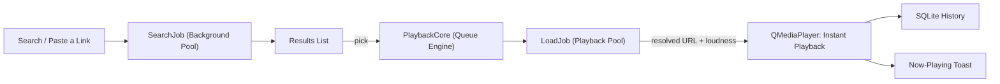

<div align="center">

# 🔥 Hearth

**A cozy floating music companion for every desktop — Arch Linux, Windows, and macOS.**

*Warm as a fireside · Light as a ribbon · Runs where you run*

<br/>


**Python 3.10+ · PyQt6 · YouTube Music · SQLite · MIT**

</div>

---

## ✨ What It Does

| Feature | The Vibe |
|:---|:---|
| 🔍 **Search or paste** | Type a song name or drop a YouTube / YT Music link straight into the field — debounced, retried, instant |
| 🪟 **Ribbon → panel** | A thin, discreet desk ribbon that blooms into an expanded player when you want to dig into the queue |
| ⌨️ **Always on top** | Floats cleanly over IDEs, browsers, and terminals — pure Qt, zero platform-specific hacks |
| 🔀 **Shuffle & repeat** | Non-destructive upcoming-queue shuffle plus cycleable repeat (off / all / one), persisted across reboots |
| ⚡ **Speed control** | Cycle 0.75x → 1.0x → 1.25x → 1.5x via native `QMediaPlayer.setPlaybackRate()` |
| ⏾ **Sleep timer** | 15–60 minute presets with a gentle exponential volume fade-out before pausing |
| 🔊 **Loudness normalization** | Stream loudness is nudged toward a target so quiet/blast tracks stop yo-yoing the volume knob |
| 🎨 **Six live themes** | Hearthlight, Emberfall, Frost, Moss, Orchid, and Slate re-skin the whole player in real time |
| ♥ **Favorites & history** | Pin tracks and revisit your listening history — stored in a local SQLite database you own |
| 🖥️ **Tray presence** | Play, pause, skip, or summon from the system tray; a second launch just wakes the first |
| ⌨️ **Hotkeys** | App-scope chords for every common action, with system-shortcut conflict detection |
| 💾 **Remembers everything** | Window position, volume, theme, repeat mode, speed, favorites, and history persist across reboots |

---

## 🐧 Arch Linux (First-Class)

Hearth is built on Arch. Two ways to run it:

### Option A — venv (recommended, most reliable)

```bash
sudo pacman -S --needed python python-pip ffmpeg git
git clone https://github.com/qtjg/hearth.git
cd hearth
./install.sh && ./launch.sh
```

The PyPI `PyQt6` wheel ships the FFmpeg multimedia backend for Linux, so audio
plays out of the box — no GStreamer plumbing required. `ffmpeg` covers the
occasional yt-dlp remux.

<details>
<summary>Tray icon notes per desktop</summary>

Works out of the box on KDE Plasma, Hyprland/sway (with a tray-capable bar like
Waybar), and any panel implementing `StatusNotifierItem`. On GNOME you'll need
an AppIndicator extension for the tray to appear — the floating ribbon itself
is unaffected.

</details>

### Option B — native pacman package

A [PKGBUILD](packaging/arch/PKGBUILD) is provided:

```bash
cd packaging/arch && makepkg -si
```

It builds against Arch's system Python and Qt6 stack (`python-pyqt6`,
`qt6-multimedia`, `gst-plugins-good`, `gst-libav`) with no venv isolation.

---

## 🪟 Windows & 🍎 macOS

```bat
install.bat
launch.bat        (or launch_debug.bat to watch the logs)
```

```bash
./install.sh && ./launch.sh
```

Both use an isolated `.venv` — your system Python stays untouched.

---

## ⌨️ Default Hotkeys

| Keys | Action |
|:---|:---|
| `Ctrl` + `Alt` + `Space` | Play / pause |
| `Ctrl` + `Alt` + `→` | Next track |
| `Ctrl` + `Alt` + `←` | Previous track |
| `Ctrl` + `Alt` + `E` | Toggle expanded panel |
| `Ctrl` + `Alt` + `F` | Focus search |

Bindings are merged from user overrides on top of the defaults and validated by
a conflict detector that flags duplicates and system-shortcut collisions
(`Ctrl+C`, `Alt+F4`, `Super+L`, …) before they can hurt you.

---

## 🏗️ How It Works (The Threading Architecture)

Stream resolution and catalogue search run completely asynchronously on
**isolated thread pools**, so audio decoding never queues behind heavy work:

1. **Playback Pool** — dedicated to `LoadJob`: the instant you pick a track,
   its audio stream is resolved off the GUI thread and handed to
   `QMediaPlayer`.
2. **Background Pool** — `SearchJob` (YT Music guest API with exponential
   retry backoff). Typing never stalls the ribbon.



---

## 🗂️ Project Structure

```
hearth/
├── hearth/
│   ├── app.py          → lifecycle, persistence, hotkeys, logging
│   ├── catalog.py      → YT Music guest search, link parsing, retry backoff
│   ├── config.py       → palettes, tunables, hotkey defaults (single source of truth)
│   ├── hotkeys.py      → conflict detection & override merging
│   ├── jobs.py         → QRunnable search/load workers on isolated pools
│   ├── models.py       → Track dataclass & serialization
│   ├── panel.py        → the floating ribbon, spring-physics EQ bars, UI
│   ├── player.py       → queue engine (pure) + lazy Qt Multimedia backend
│   ├── storage.py      → SQLite favorites & playback history
│   ├── stream.py       → yt-dlp resolver, format picker, loudness gain
│   ├── theme.py        → stylesheets compiled from Palette tokens
│   ├── toast.py        → non-focus-stealing now-playing toast
│   ├── tray.py         → tray presence, painted icon, single-instance guard
│   └── utils.py        → small zero-dependency helpers
├── tests/              → 60+ headless tests (offscreen Qt platform)
├── packaging/arch/     → PKGBUILD for a native Arch package
├── install.sh / .bat   → one-command venv setup per OS
├── launch.sh / .bat    → silent desktop launchers
└── pyproject.toml      → `pip install .` gives you the `hearth` command
```

---

## 🧪 Testing

60+ tests cover models, palettes, storage, retry backoff, format picking,
queue semantics, hotkey conflicts, and the real UI booting headless:

```bash
QT_QPA_PLATFORM=offscreen python -m pytest tests/ -v
```

CI runs the same suite on a **3 OS × 2 Python matrix** (ubuntu / windows /
macos × 3.11 / 3.13) on every push — the "every desktop" promise is enforced,
not just claimed.

---

## 🗺️ Roadmap

- ♾️ Endless radio queue from the recommendation graph
- 🎤 Live lyrics tab
- ♥ Favorites tab in the expanded panel
- 📦 AUR package publication

---

## 📜 License

**Hearth** is distributed under the [MIT License](LICENSE).

<div align="center">
<sub><strong>Hearth</strong> — keep the fire warm. 🔥</sub>
</div>
