<p align="center">
  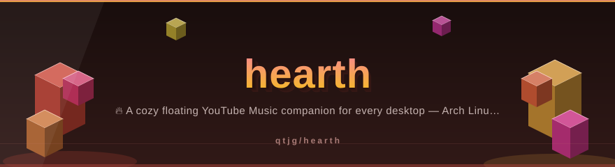
</p>

<!-- ⬡ 3D-UPGRADE v2 by Mayank Bhaskar -->
<div align="center">

**made by [Mayank Bhaskar](https://github.com/qtjg)** ·  

</div>

---
🩺 **New tool — `repo-pulse`**: instant git pulse (28-day heat bars, hot files, contributors). Run: `python3 tools/repo_pulse.py`

<div align="center">

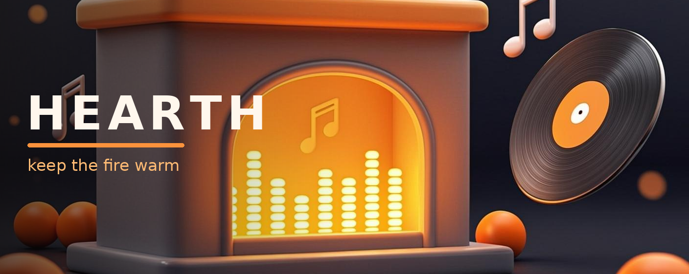


<a href="https://github.com/qtjg/hearth"></a>

[](https://github.com/qtjg/hearth/actions/workflows/ci.yml)


**A full three-pane desktop music player for YouTube Music.**

*Sidebar navigation · Home shelves · Playlists · Now Playing with lyrics · Endless radio · Runs where you run*

<a href="https://github.com/qtjg"></a>
<a href="https://github.com/qtjg?tab=followers"></a>


</div>

<details open>
<summary><strong>📑 Jump around</strong> — the whole README, indexed</summary>

[🧊 The System, in 3D](#-the-system-in-3d) · [🔥 The Immune System](#-the-immune-system--self-healing-playback-v063) · [🐍 The Firekeeper Snake](#-the-firekeeper-snake) · [📸 Inside the Hearth](#-inside-the-hearth) · [🎤 Spotlight v0.6.1](#-spotlight--artist-pages--words-that-keep-the-beat-v061) · [🪞 Glass & Motion v0.6.2](#-glass--motion--the-2020s-pass-v062) · [🖼️ The Big Window v0.3](#-the-big-window-v03) · [📻 Radio & Words v0.4/v0.5](#-radio-lyrics--words-v04--v05) · [🌍 Discover v0.6](#-discover--every-music-in-the-world-v06) · [🗺️ World Explorer v0.6](#-world-explorer--the-curated-dial-v06) · [🧭 How Hearth Grew](#-how-hearth-grew) · [✨ What It Does](#-what-it-does) · [🐧 Install](#-arch-linux-first-class) · [⌨️ Hotkeys](#-default-hotkeys) · [🗂️ Structure](#-project-structure) · [🧪 Testing](#-testing) · [🗺️ Roadmap](#-roadmap) · [👤 Made by Mayank](#-made-by-mayank-bhaskar) · [📜 License](#-license)

</details>

---

## 🧊 The System, in 3D

Every diagram below is hand-built, zero-dependency animated SVG (pure SMIL —
no JavaScript, no external services) living in
[`docs/assets/`](docs/assets/). They float, glow, and flow directly on GitHub —
zoom in, they're lossless at any size.

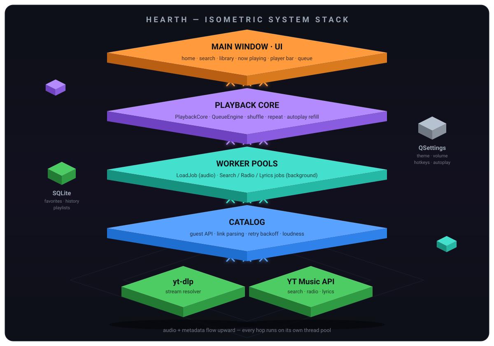

Hearth is a stack of floating layers, and the anim shows exactly how a request
travels: everything enters through the **main window**, drops into the
**playback core** (a pure queue engine wrapped by a thin Qt backend), fans out
to **isolated thread pools** so heavy network work never touches the GUI loop,
resolves through the **catalog** (guest API, link parsing, exponential retry
backoff, loudness hints), and finally lands on the **sources** — `yt-dlp` for
streams, YT Music's guest API for search, radio and lyrics. Your data never
leaves the machine: SQLite keeps favorites, history and playlists, QSettings
keeps the knobs. The mermaid flowchart below traces one request end to end —
and if you want the moving picture of the *failure* paths, the 🔥 [immune
system](#-the-immune-system--self-healing-playback-v063) has its own diagram.

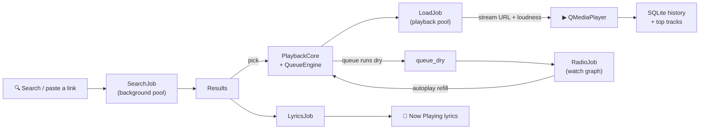

### 🔥 The immune system — self-healing playback (v0.6.3)

Streams die — CDN 403s, dropped sockets, URLs that never open. The audio core
treats every failure honestly, and the whole immune system is one moving
picture:


- **↺ Rejoin** — a stream that *audibly played* and died mid-song gets a fresh
  URL and rejoins where it stopped. Budget: three tries, renewed by 30 seconds
  of healthy playback, so one flaky minute can't strand the session.
- **⇥ Skip** — a stream that never opened (dead URL, CDN 403) is skipped **once
  per proven track** and *never re-fed* — re-feeding it was the
  `Could not open media` spam storm, now gone.
- **■ Halt** — three dead tracks in a row end in a clean stop with a clear
  status: no silent zombie pauses, no flooded terminal. Qt's own chatter now
  lands in the rotating `hearth.log` instead of stderr, demoted to debug.

<details>
<summary>🧊 About the 3D artwork</summary>

All of them are committed SVGs rendered with isometric polygons, layered
gradients and SMIL keyframe animations (`animate`, `animateTransform`,
`animateMotion`), so they animate inside GitHub's sanitized `` pipeline
with **zero** JavaScript and **zero** third-party requests. The 🔥 ember
dividers dance between sections on the same diet — and the 🤖 **Hearth
Keeper**, the project's own 3D mascot, waves from the maker section below
with a flame in its chest, blinking eyes and a beaming smile. Want them
standalone? Open
[`docs/assets/hero-3d.svg`](docs/assets/hero-3d.svg),
[`docs/assets/arch-3d.svg`](docs/assets/arch-3d.svg),
[`docs/assets/spotlight-3d.svg`](docs/assets/spotlight-3d.svg),
[`docs/assets/selfheal-3d.svg`](docs/assets/selfheal-3d.svg),
[`docs/assets/hearth-keeper.svg`](docs/assets/hearth-keeper.svg) or
[`docs/assets/ember-divider.svg`](docs/assets/ember-divider.svg) in any browser
and watch the equalizer dance, the stack hover, the Keeper wave and the lyric
beam flow in real time.

</details>

## 🐍 The Firekeeper Snake

Every six hours a scheduled action feeds qtjg's contribution graph to a snake,
and it slithers through every green square it has earned. Light and dark
variants land on the `output` branch and swap automatically to match your
GitHub theme:

<picture>
  <source media="(prefers-color-scheme: dark)" srcset="https://raw.githubusercontent.com/qtjg/hearth/output/github-contribution-grid-snake-dark.svg"/>
  <source media="(prefers-color-scheme: light)" srcset="https://raw.githubusercontent.com/qtjg/hearth/output/github-contribution-grid-snake.svg"/>
  
</picture>


## 📸 Inside the Hearth

Real pixels, not mockups — captured from the app itself (headless offscreen
render) with a little fictional demo data:

<table>
  <tr>
    <td width="50%" align="center">
      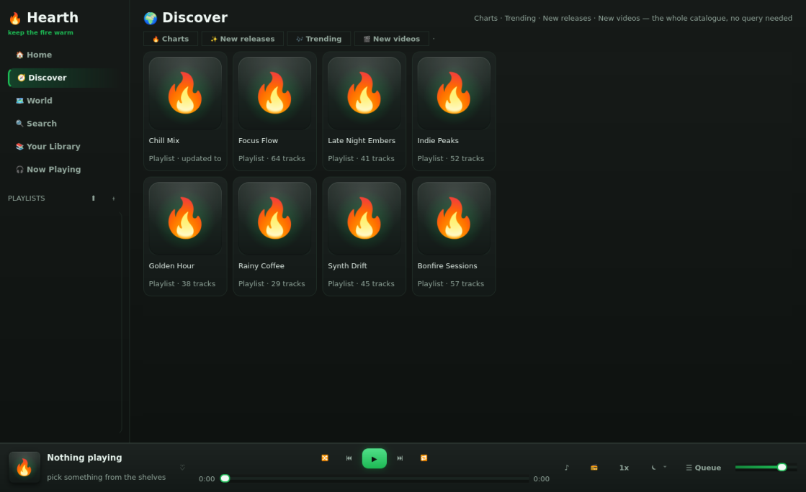<br/>
      <sub>🧭 <b>Discover</b> — charts, moods & shelves, zero typing</sub>
    </td>
    <td width="50%" align="center">
      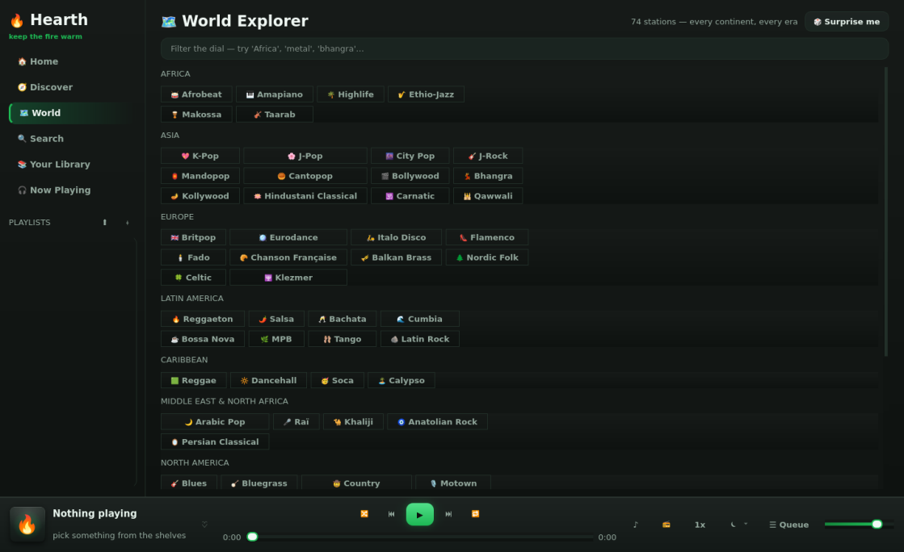<br/>
      <sub>🗺️ <b>World Explorer</b> — 74 stations across nine regions</sub>
    </td>
  </tr>
  <tr>
    <td width="50%" align="center">
      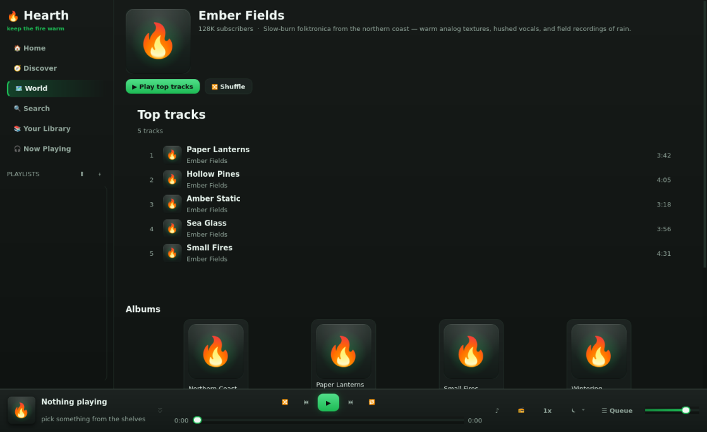<br/>
      <sub>🎤 <b>Spotlight</b> — an artist page: face, story, top tracks</sub>
    </td>
    <td width="50%" align="center">
      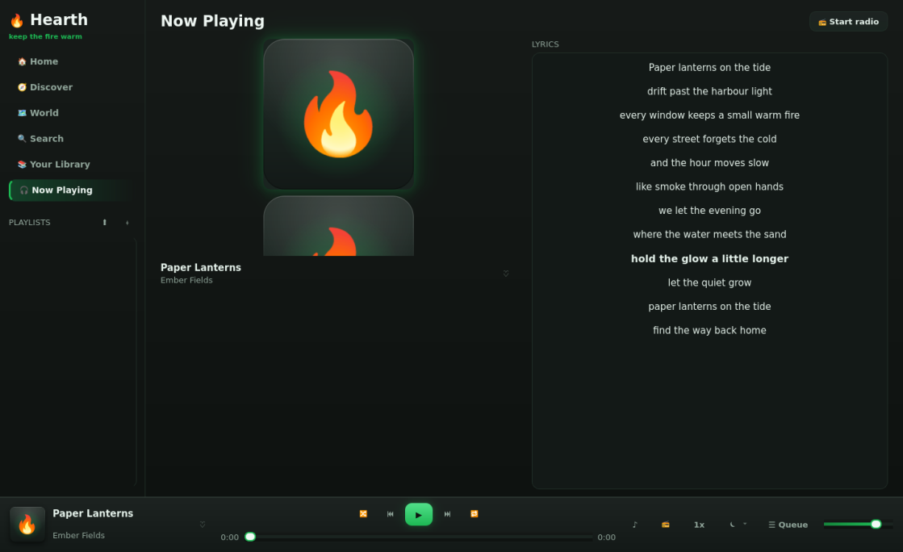<br/>
      <sub>✨ <b>Synced lyrics</b> — the current line glows; click any line to seek</sub>
    </td>
  </tr>
</table>

---

## 🎤 Spotlight — Artist Pages & Words That Keep the Beat (v0.6.1)

Two long-requested upgrades land together: every artist gets a stage, and
every lyric line gets its moment. The whole spotlight system, in one moving
picture:

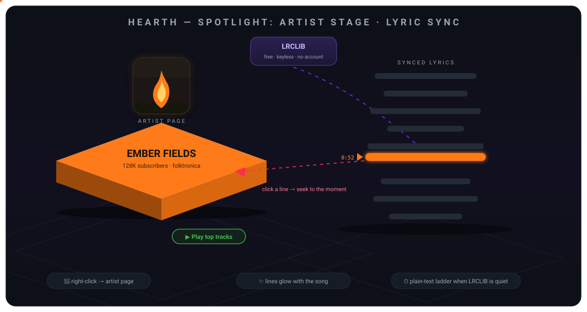

- **🎤 Artist pages** — right-click any track → *🎤 Artist page* (it works
  from album pages and related-artist chips too): a real artist stage with
  the face, the story and subscriber count, **top tracks** ready to play or
  shuffle, every **album and single** as cover cards that open the full
  album page, and a **Fans also like** rail for hopping between kindred
  acts. No channel id on a rare track? Hearth finds the artist by name and
  opens the stage anyway.
- **✨ Synced lyrics** — hearth now asks LRCLIB (free, keyless, no account)
  for time-cued LRC: the current line **glows in the palette accent** and
  stays centered while the song moves, and **clicking any line seeks
  straight to that moment** — instant karaoke. When no timed lyrics exist
  it degrades in steps: LRCLIB plain text → the YT Music catalogue → the
  cozy “no lyrics” note. Everything is cached per track, fetched off the
  main thread, and never allowed to break playback.
- **🖼️ Banner art** — the README now opens on a cinematic 3D cover: the
  fireplace, equalizer flames, floating notes and a vinyl — hearth's whole
  personality in one image.

The lyrics ladder, end to end — and playback never waits on it:

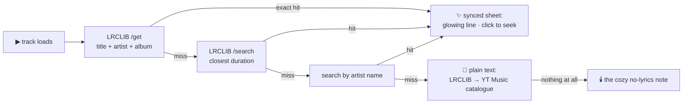

## 🖼️ The Big Window (v0.3)

Hearth grew from a floating ribbon into a complete desktop music app, laid out
the way every major streaming client works — three panes, one window:

- **Left sidebar** — Home, Search, and Your Library navigation, plus all of
  your playlists with one-click creation.
- **Home** — horizontally scrolling shelves: Quick Picks seeded from guest-API
  searches, your Pinned favorites, and Recently played, all as big cover cards.
- **Search** — a prominent query box (debounced, link-aware) over clean result
  rows with mini covers, artist, and duration.
- **Your Library** — pinned favorites, recent history, and playlist cards.
- **Playlists** — create, rename, delete; add any track via its context menu
  (▶ Play next · ➕ Add to queue · ♡ Pin · 📌 Add to playlist); Play-all and
  Shuffle buttons on every playlist page.
- **Bottom player bar** — cover tile, ♡ pin, shuffle / repeat, prev / play /
  next, draggable seek with time labels, queue drawer, and a volume slider.
- **Queue drawer** — dockable "Up next" panel; right-click any row to remove it.

## 📻 Radio, Lyrics & Words (v0.4 / v0.5)

The clone wave: the features people actually live in on the big streaming
services, built on the same guest-API engine — no account, no keys:

- **Now Playing view** — a full page with a big cover, the current track's
  identity, a ♡ pin, and a live lyrics sheet (auto-loaded per track, cached,
  with a graceful "no lyrics" state).
- **📻 Start Radio** — right-click any track, hit the player-bar button, or
  press it on the Now Playing page: hearth fetches related tracks from the
  YT Music watch graph and queues them around your seed.
- **♾️ Endless autoplay** — when the queue runs dry (repeat off), the radio
  engine quietly refills it and the music keeps going. That's the whole point.
- **🔍 Search scopes** — ♪ Songs · ▶ Videos · 💿 Albums chips. Album results
  open a real album page with ▶ Play all and 🔀 Shuffle.
- **🎛️ Queue power tools** — drag & drop reordering (the playing row stays
  pinned), ▶ Play now, ↑↓ move, ✕ remove, and a Clear button. Double-click
  any upcoming row to jump straight to it.
- **🔥 Top tracks** — a Home shelf ranked by your real play counts.
- **⌨️ In-window keys** — `Space` play/pause · `←`/`→` seek ±10s · `↑`/`↓`
  volume · `/` search · `M` mute · `S` shuffle · `R` repeat · `N` now playing
  · `Q` queue — all guarded, so typing in the search box never triggers them.
- **💾 Library backup** — export or import every playlist as portable JSON
  (`.hearthplaylist.json`), plus full-library favorites+playlists export via
  the store API. Files are boring JSON on purpose: no lock-in, no cloud.
- **🔗 Copy YouTube link** — every track's context menu carries its URL.
- **🎚️ Speed cycler & ⏾ sleep menu** live on the player bar (`1x` and `⏾`).

Love the old vibe? The original floating ribbon is still there: run
`./launch.sh --ribbon` (or `python -m hearth --ribbon`) for the compact
always-on-top companion. Legacy and new share the same engine.

## 🌍 Discover — Every Music in the World (v0.6)

The whole YT Music catalogue, browsable without typing a single query. A new
🧭 **Discover** tab opens the same shelves the streaming giants use — moods,
genres, charts, releases — and every card plays in one tap:

- **🔥 Charts** — Daily & Top-100 global music video charts, straight from
  YT Music's chart engine.
- **🎶 Trending** — the 20 tracks the world is playing right now.
- **✨ New releases** — every fresh album this week (cards open real album
  pages with Play all / Shuffle).
- **🎬 New videos** — brand-new official music videos, playable list.
- **Moods & moments** — Chill, Focus, Party, Romance, Gaming… ~280 curated
  playlists per mood.
- **Genres** — Bollywood & Indian, Hip-hop, Classical, Dance, Decades,
  Indonesian and a dozen more — the world's music, literally. (This needed a
  custom junk-card-tolerant parser layer: one malformed promo card used to
  kill an entire shelf upstream — hearth skips the junk, keeps the shelf.)
- **Every curated page** carries ▶ Play all · 🔀 Shuffle · ➕ Queue all
  (100+ tracks straight into the up-next queue), plus per-track context
  menus — pin, radio, play-next, add-to-playlist, copy link.

## 🗺️ World Explorer — the Curated Dial (v0.6)

Discover browses what YT Music's shelves serve today. The **🗺️ World** tab is
the other half of the promise — a hand-built dial of **74 genre stations**
spanning **nine regions of sound**, so every kind of music on Earth is one
tap away even when the network (or the guest API) is having a bad day:

- **🥁 Africa** — Afrobeat, Amapiano, Highlife, Ethio-Jazz, Makossa, Taarab
- **🌸 Asia** — K-Pop, J-Pop, City Pop, Mandopop, Cantopop, Bollywood,
  Bhangra, Kollywood, Hindustani & Carnatic classical, Qawwali
- **🇬🇧 Europe** — Britpop, Eurodance, Italo Disco, Flamenco, Fado, Chanson,
  Balkan Brass, Nordic Folk, Celtic, Klezmer
- **🌶️ Latin America** — Reggaeton, Salsa, Bachata, Cumbia, Bossa Nova, MPB,
  Tango, Rock en español · **🟩 Caribbean** — Reggae, Dancehall, Soca, Calypso
- **🌙 MENA** — Arabic Pop, Raï, Khaliji, Anatolian Rock, Persian Classical
- **🎸 North America** — Blues, Bluegrass, Country, Motown, Funk, Gospel,
  New Orleans Jazz, Surf Rock
- **🏠 Global & Electronic** — House, Techno, Trance, DnB, Dubstep, Ambient,
  Lo-Fi, Synthwave, Jazz, Classical, Hip-Hop, R&B, Metal, Punk, Indie
- **📼 Eras** — 60s Oldies → 2010s Bangers

Each dial spins a **station**: rotating search seeds (same genre, fresh mix
every visit), instant queue-up. **🔎 Filter** the dial ("africa", "metal",
"bhangra"…) and **🎲 Surprise me** tunes anywhere on Earth.

**🔍 Search-everywhere fallback:** when the guest catalogue has never heard
of a track — rare live cuts, B-sides, regional uploads — hearth falls back
to the web (songs → videos → yt-dlp's index), so "we can't find it" comes
as close to impossible as a player can get:

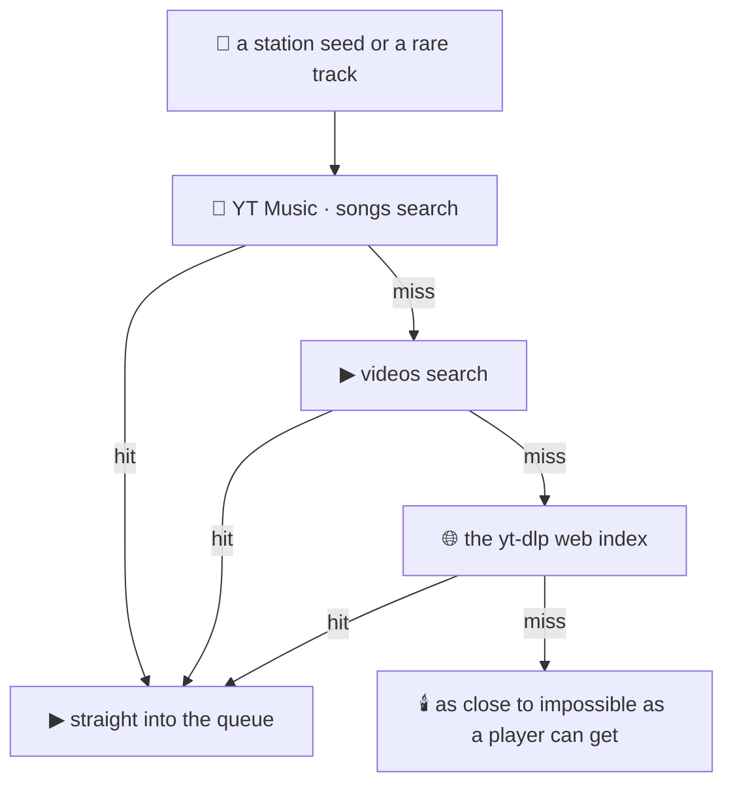

## 🪞 Glass & Motion — the 2020s Pass (v0.6.2)

Same cozy hearth, new physics. Every flat fill from the last decade got
an upgrade to the current one — depth, light, and motion, all painted by
pure Qt (no new dependencies, no engine swap):

- **🪟 Glass surfaces** — the window, player bar, sidebar, ribbon and
  cards now sit on vertical light-to-dark gradients with a bright rim
  catching the light on top edges; menus, tooltips and the toast wear
  the same rounded glass
- **🫧 Real shadows & glows** — the big Now Playing cover floats on an
  accent halo, the transport's play button glows in the theme color,
  the bar cover casts a soft ground shadow — and every glow recolors
  itself when you swap palettes
- **🪩 3D covers** — album art lands in rounded, beveled frames with a
  glass sheen; the painted flame mark gets a lit-from-above shell and an
  accent bloom behind the glyph; the Now stage mirrors its cover in a
  fading floor reflection
- **🎞️ Motion everywhere** — views crossfade as you navigate, the toast
  rises into place while fading in, the equalizer bars turned glossy
  (bright cap → deep base, each glowing onto the surface behind it)
- **🎛️ Modern controls** — gradient accent buttons, pill chips, nav
  items with an accent edge, sliders with white-ring handles and a
  gradient fill, softer scrollbars, a modern type stack

All of it derives from the same seven palettes at compile time — pick
**Frost**, **Orchid**, **Grove** or any other theme and the whole 2020s
layer recolors with it.

See it in real pixels: every screenshot in 📸 [Inside the
Hearth](#-inside-the-hearth) already wears this pass — the accent halo
behind covers, the gradient surfaces and the floor reflection are the
glass layer doing its thing.

## 🧭 How Hearth Grew

Five ships, five waves — each one a full layer of the app:

| Version | Wave | What landed |
|:---|:---|:---|
| v0.3 | 🖼️ The Big Window | three panes, playlists, queue drawer, tray presence |
| v0.4 | 📻 Radio & Words | Now Playing page, Start Radio, endless autoplay, library backup |
| v0.5 | 🔍 Scopes & Shortcuts | search scopes, album pages, top tracks, in-window hotkeys |
| v0.6 | 🌍 Discover + 🗺️ World Explorer | the whole YT Music catalogue + a 74-station world dial |
| v0.6.1 | 🎤 Spotlight | artist pages, synced lyrics, banner art |
| v0.6.2 | 🪞 Glass & Motion | gradients, glass, shadows, glows, 3D covers, view crossfades |
| **v0.6.3** | 🔥 Keep the Fire Burning | the sudden-stop fix — tracks roll into the next one again, streams that die mid-song get rejoined, dead URLs are skipped once and never re-fed, no spam storms, no zombie pauses |
| **v0.7.0** | 🔥 The Big Burn | memory & rituals — On Repeat, history, Glow Mix, queue persistence + the wider stage — overlay, theater, style closet + services — MPRIS, Discord RPC, stats + plugins, local library, ambient mixer |
| **v0.7.1** | 🧠 Smarts & reach | smart shelves, Rewind story, phone remote (LAN web remote) |
| **v0.7.2** | 🔥 Ember tending | café ambience, per-track volume nudges, weighted smart shuffle, per-leg fetch counters, shareable Rewind card — **current release** |

### 🆕 New stuff — the add-on map

Every recent wave left add-ons behind. Here's the whole crate, where each one
lives, and the fastest way to feel it:

| Add-on | Wave | Where it lives | Try this first |
|:---|:---|:---|:---|
| 🧠 **On Repeat & full history** | v0.7.0 | the Home shelf + the 🕘 History tab | play a few favorites — the On Repeat shelf re-ranks itself (last week beats last year), then tap a day chip to jump back two weeks |
| ✨ **Glow Mix** | v0.7.0 | the ✨ chip on the On Repeat shelf | hit it — your heavy rotation blended with kindred radio tracks, shuffled straight into the queue |
| 🪧 **Lyrics overlay & 🎭 theater** | v0.7.0 | tray → *🪧 Desktop lyrics* · the 🎭 nav action | send the glowing lyric line over every window (drag it anywhere), then go full-screen theater — `Esc` brings you home |
| ⌨️ **Ctrl+K command palette** | v0.7.0 | anywhere | press `Ctrl+K` and type — themes, speeds, "go to history" — every action ranked as you type |
| 🪞 **Style closet & wallpapers** | v0.7.0 | the 🪞 button in the sidebar PLAYLISTS header | wear **Frosted Glass**, upload your own background, slide the see-through dial from 30–100% |
| 📊 **Stats dashboard** | v0.7.0 | the 📊 Stats tab | plays, unique tracks, estimated minutes, days listened, top tracks & artists, month bars |
| 🎮 **MPRIS & Discord Rich Presence** | v0.7.0 | your desktop's media keys + your Discord profile | hit your keyboard's play key — hearth obeys; then flip the 🎮 tray toggle so friends can Listen Along |
| 🔀 **Smart shuffle** | v0.7.0 | the 🔀 shuffle button | artists spread out and recently-heard tracks rest — same button, grown-up shuffle |
| 🌫️ **Ambient mixer** | v0.7.0 | tray → *🌫️ Ambient* | layer procedural campfire or rain (synthesized live — zero audio files) under the music |
| 🔌 **Plugins & 📁 Local library** | v0.7.0 | the 📁 Local tab + `<appdata>/plugins` | 📂 Add folder… scans your own mp3/flac into hearth; drop a plugin in for palettes & home shelves |
| 🔥 **Self-healing playback** | v0.6.3 | the audio core | start a radio and walk away — finished tracks roll on by themselves, a stream that dies mid-song gets rejoined, and a URL that never opens is skipped once, never re-fed |
| 🪞 **Glass & Motion** | v0.6.2 | the entire window | swap to **Frost** or **Orchid** in the tray — every gradient, glow and 3D cover repaints itself |
| 🪩 **3D covers & reflections** | v0.6.2 | Now Playing & every card grid | press `N` — the cover floats on an accent halo over a fading floor mirror |
| 🎤 **Artist pages** | v0.6.1 | right-click any track → *🎤 Artist page* | shuffle the **Top tracks**, then hop the **Fans also like** rail |
| ✨ **Synced lyrics** | v0.6.1 | the Now Playing stage | click any glowing line to send the song there — instant karaoke |
| 🌍 **Discover** | v0.6 | the 🧭 tab | tap a mood chip (Chill, Focus, Party…), then **▶ Play all** |
| 🗺️ **World Explorer** | v0.6 | the 🗺️ tab | **🎲 Surprise me** — 74 stations across nine regions, one tap |
| 🔎 **Search fallback** | v0.6 | everywhere | paste a rare track name — songs → videos → the web index, it finds it |
| 📻 **Endless radio** | v0.4 | right-click → *📻 Start Radio* | let the queue run dry and watch it refill itself |
| 🔍 **Scopes & hotkeys** | v0.5 | the search box | `/` to jump in, `S` shuffle, `R` repeat, `Q` queue |

**New here? The 60-second tour:** open 🧭 **Discover** and tap a mood → hop
to 🗺️ **World** and hit **🎲 Surprise me** → right-click any track and choose
**🎤 Artist page** → press `N` for the Now Playing stage and watch the ✨
lyric lines glow in time — click one to send the song there → finish on the
player bar: swap themes and watch the whole 🪞 glass layer recolor itself.
That's the last four releases in one lap of the room.


## ✨ What It Does

| Feature | The Vibe |
|:---|:---|
| 🖼️ **Three-pane main window** | Sidebar + home shelves + library views + bottom transport — the full desktop-player experience |
| 🎵 **Playlists that stick** | Create, rename, delete, reorder-safe add/remove — stored in the SQLite database you own |
| 📋 **Queue drawer** | See and prune what's coming; Play-next jumps the line, Add-to-queue appends |
| 🔍 **Search or paste** | Type a song name or drop a YouTube / YT Music link — debounced, retried, instant |
| 🪟 **Ribbon companion** | The classic floating always-on-top mini player still ships (`--ribbon`) for IDE-side listening |
| 🔀 **Shuffle & repeat** | Non-destructive upcoming-queue shuffle plus cycleable repeat (off / all / one), persisted across reboots |
| ⚡ **Speed control** | Cycle 0.75x → 1.0x → 1.25x → 1.5x via native `QMediaPlayer.setPlaybackRate()` |
| ⏾ **Sleep timer** | 15–60 minute presets with a gentle exponential volume fade-out before pausing |
| 🔊 **Loudness normalization** | Stream loudness is nudged toward a target so quiet/blast tracks stop yo-yoing the volume knob |
| 🎨 **Seven live themes** | Grove (the new default), Hearthlight, Emberfall, Frost, Moss, Orchid, and Slate re-skin everything in real time |
| ♥ **Favorites & history** | Pin tracks and revisit your listening history — local SQLite, no account, no telemetry |
| 🖥️ **Tray presence** | Play, pause, skip, or summon the window from the system tray; a second launch just wakes the first |
| ⌨️ **Hotkeys** | App-scope chords for every common action, with system-shortcut conflict detection |
| 📻 **Radio & autoplay** | Endless playback: Start Radio from any track, auto-refill when the queue dries |
| 🌍 **[Discover the world](#-discover--every-music-in-the-world-v06)** · v0.6 🆕 | Charts, trending, new releases, moods & genres — every playlist on YT Music, browsable without typing |
| 🗺️ **[World Explorer](#-world-explorer--the-curated-dial-v06)** · v0.6 🆕 | 74 curated genre stations across 9 regions, filter + dice, search-everywhere web fallback |
| 🎤 **[Artist pages](#-spotlight--artist-pages--words-that-keep-the-beat-v061)** · v0.6.1 🆕 | Face, story, top tracks, albums & singles, kindred acts — every artist one context-menu tap away |
| ✨ **[Synced lyrics](#-spotlight--artist-pages--words-that-keep-the-beat-v061)** · v0.6.1 🆕 | LRCLIB time-cued lines that glow with the song; click any line to seek; graceful plain-text fallbacks |
| 🪞 **[Glass & Motion](#-glass--motion--the-2020s-pass-v062)** · v0.6.2 🆕 | Gradient glass surfaces, accent glows, 3D beveled covers with floor reflections, view crossfades — the whole layer recolors per theme |
| 🧠 **On Repeat & day history** · v0.7.0 🆕 | The Home shelf re-ranks your most-played with a decay curve; the 🕘 History tab jumps to any of the last 14 listening days |
| ✨ **Glow Mix** · v0.7.0 🆕 | One tap blends your heavy rotation with kindred radio tracks into a fresh shuffled queue |
| 🪧 **Desktop lyrics overlay** · v0.7.0 🆕 | The glowing current line floats above every window — draggable, palette-aware, opt-in |
| 🎭 **Theater mode** · v0.7.0 🆕 | Full-screen Now Playing: giant glowing cover, huge lyric line, `Esc` back to the room |
| 🪞 **Style closet & wallpapers** · v0.7.0 🆕 | Four style packs, your own background image, a see-through dial from 30–100% — all persisted |
| ⌨️ **Ctrl+K command palette** · v0.7.0 🆕 | Fuzzy-search every action — play, themes, speeds, go-to-view — from anywhere |
| 📊 **Stats dashboard** · v0.7.0 🆕 | Plays, unique tracks, estimated minutes, days listened, top tracks & artists, month bars |
| 🎮 **MPRIS & media keys** · v0.7.0 🆕 | Your desktop's play/pause keys drive hearth with real metadata — even when the window is buried |
| 💬 **Discord Rich Presence** · v0.7.0 🆕 | Opt-in presence with a Listen Along button — `pip install hearth-music[discord]` |
| 🔀 **Smart shuffle** · v0.7.0 🆕 | Artists spread out, recently-heard tracks rest — shuffle with taste |
| ⏰ **Wake-up alarm** · v0.7.0 🆕 | The sleep timer's sibling: set it from the tray and music fades in over 15–60 minutes |
| 🎚️ **Equal-power crossfade** · v0.7.0 🆕 | Opt-in 0–3s fade at the song's natural end, with the next stream pre-resolved in the background |
| 📼 **Mini-visualizer** · v0.7.0 🆕 | Accent-tinted bars dance in the player bar while the music plays |
| ⏱️ **Per-track speed memory** · v0.7.0 🆕 | That podcast stays at 1.5x — the playback rate is remembered per track |
| 🔌 **Plugins & local library** · v0.7.0 🆕 | Drop a folder into `<appdata>/plugins` for palettes & shelves; 📂 Add folder… scans your mp3/flac into 📁 Local |
| 🌫️ **Ambient mixer** · v0.7.0 🆕 | Procedural campfire & rain, synthesized live under the music — zero audio files |
| 📤 **Playlist export & import** · v0.7.0 🆕 | Playlists round-trip as JSON and M3U — export all, import back, no lock-in |
| 🕯️ **Update whisper & 🩺 diagnostics** · v0.7.0 🆕 | Opt-in, dismissible release checks; a tray report of identity, database & log health |
| 💿 **Album pages** | Search Albums scope → full track list with Play all / Shuffle |
| 🔥 **Top tracks** | Home shelf ranked by your real play counts |
| 💾 **Remembers everything** | Window size/position, volume, theme, repeat mode, speed, autoplay, favorites, playlists, and history persist |

---

## 🐧 Arch Linux (First-Class)

Hearth is built on Arch. Two ways to run it:

### Option A — venv (recommended, most reliable)

```bash
sudo pacman -S --needed python python-pip ffmpeg git
git clone https://github.com/qtjg/hearth.git
cd hearth
./install.sh && ./launch.sh
```

The PyPI `PyQt6` wheel ships the FFmpeg multimedia backend for Linux, so audio
plays out of the box — no GStreamer plumbing required. `ffmpeg` covers the
occasional yt-dlp remux.

<details>
<summary>Tray icon notes per desktop</summary>

Works out of the box on KDE Plasma, Hyprland/sway (with a tray-capable bar like
Waybar), and any panel implementing `StatusNotifierItem`. On GNOME you'll need
an AppIndicator extension for the tray to appear — the floating ribbon itself
is unaffected.

</details>

### Option B — native pacman package

A [PKGBUILD](packaging/arch/PKGBUILD) is provided:

```bash
cd packaging/arch && makepkg -si
```

It builds against Arch's system Python and Qt6 stack (`python-pyqt6`,
`qt6-multimedia`, `gst-plugins-good`, `gst-libav`) with no venv isolation.

---

## 🪟 Windows & 🍎 macOS

```bat
install.bat
launch.bat        (or launch_debug.bat to watch the logs)
```

```bash
./install.sh && ./launch.sh
```

Both use an isolated `.venv` — your system Python stays untouched.

---

## ⌨️ Default Hotkeys

| Keys | Action |
|:---|:---|
| `Ctrl` + `Alt` + `Space` | Play / pause |
| `Ctrl` + `Alt` + `→` | Next track |
| `Ctrl` + `Alt` + `←` | Previous track |
| `Ctrl` + `Alt` + `E` | Toggle the window / ribbon |
| `Ctrl` + `Alt` + `F` | Focus search |
| `Ctrl` + `K` | Command palette — every action, fuzzy-searched |

**In-window keys** (v0.5) work wherever you are — `Space` play/pause,
`←`/`→` seek ±10s, `↑`/`↓` volume, `/` focus search, `M` mute, `S` shuffle,
`R` repeat, `N` Now Playing, `Q` queue drawer. They yield automatically while
you're typing in the search box.

Bindings are merged from user overrides on top of the defaults and validated by
a conflict detector that flags duplicates and system-shortcut collisions
(`Ctrl+C`, `Alt+F4`, `Super+L`, …) before they can hurt you.

---

## 🗂️ Project Structure

```
hearth/
├── hearth/
│   ├── app.py          → lifecycle, persistence, hotkeys, logging
│   ├── catalog.py      → YT Music guest search, link parsing, retry backoff
│   ├── config.py       → palettes, tunables, hotkey defaults (single source of truth)
│   ├── cover.py        → cover tiles: painted flame fallback + async album art
│   ├── hotkeys.py      → conflict detection & override merging
│   ├── jobs.py         → QRunnable search/load workers on isolated pools
│   ├── lyrics.py       → LRC parser, sync engine & LRCLIB client (keyless)
│   ├── models.py       → Track / Album / Artist dataclasses & serialization
│   ├── panel.py        → the floating ribbon (legacy companion UI)
│   ├── player.py       → queue engine (pure) + lazy Qt Multimedia backend
│   ├── share.py        → playlist JSON encode/decode for portable exports
│   ├── storage.py      → SQLite favorites, history & playlists
│   ├── stream.py       → yt-dlp resolver, format picker, loudness gain
│   ├── theme.py        → stylesheets compiled from Palette tokens
│   ├── toast.py        → non-focus-stealing now-playing toast
│   ├── tray.py         → tray presence, painted icon, single-instance guard
│   ├── window.py       → the three-pane main window (sidebar/shelves/transport)
│   ├── world.py        → the 74-genre World Explorer universe (pure data)
│   ├── ytm_resilience.py → junk-card-tolerant YT Music parser layer (Discover)
│   └── utils.py        → small zero-dependency helpers
├── docs/assets/        → animated 3D SVG artwork, banner art & screenshots used by this README
├── tests/              → 588 headless tests (offscreen Qt platform)
├── packaging/arch/     → PKGBUILD for a native Arch package
├── install.sh / .bat   → one-command venv setup per OS
├── launch.sh / .bat    → silent desktop launchers
└── pyproject.toml      → `pip install .` gives you the `hearth` command;
                         `pip install hearth-music[discord]` adds Discord Rich Presence
```

---

## 🧪 Testing

588 tests cover models, palettes, playlists, share codecs, storage, retry
backoff, format picking, queue semantics, radio + autoplay refill, lyrics
caching, LRC parsing, the LRCLIB fallback ladder, artist-page mapping
(catalogue, jobs, view, app drill-down), hotkey conflicts, the genre
universe (every dial described, seed rotation), search-everywhere fallback
ladders, the main window (views, player bar, queue dock with drag & drop,
pin flow), the player's full immune system (rejoin budgets, dead-URL skips,
watchdog stalls, buffering grace, the proof-of-audio gate), the Qt message
bridge, the real app booting headless — and the whole Big Burn: memory &
rituals (decay-ranked On Repeat, day-grouped history, stats, queue
snapshots, JSON/M3U round-trips), the wider stage (overlay, theater,
palette packs, style closet & wallpapers), controls (Ctrl+K palette, smart
shuffle, the alarm fade, per-track speed memory, the mini-visualizer),
services (MPRIS on a fake bus, update whisper, diagnostics), equal-power
crossfade with a primed shadow player, plugins & the local scanner, the
ambient DSP, i18n + scrobble scaffolds, and Discord Rich Presence:

```bash
QT_QPA_PLATFORM=offscreen python -m pytest tests/ -v
```

CI runs the same suite on a **3 OS × 2 Python matrix** (ubuntu / windows /
macos × 3.11 / 3.13) on every push — the "every desktop" promise is enforced,
not just claimed.

---

## 🗺️ Roadmap

The living plan — waves, acceptance criteria, and the wish pool — lives in
**[ROADMAP.md](ROADMAP.md)**. Every planned add-on now burns inside ONE
main version — **v0.7.0 "The Big Burn"** — four rooms, built in order:

- 🕯️ **Memory & Rituals**: listen history shelves, "On Repeat" smart
  playlist, the Glow Mix, queue persistence, Discord Rich Presence,
  playlist export/import, stats dashboard + a yearly Wrapped story
- 🎭 **The Wider Stage**: desktop lyrics overlay, theater mode, palette
  packs + theme editor, per-track speed memory, lyrics settings &
  translation, Ctrl+K command palette, ambient mixer, wake-up alarm
- 📦 **Reach**: AUR / winget / brew, update whisper, diagnostics,
  MPRIS + media keys
- 🎪 **The Festival**: gapless playback, native backend probe, plugin
  hooks, multi-language UI, smart shuffle

The Big Burn burned bright: every room landed — On Repeat, history, Glow
Mix and queue persistence on the memory side, the overlay & theater stage,
the style closet, Ctrl+K, smart shuffle, stats, MPRIS, Discord RPC,
crossfade, plugins, the local library and the ambient mixer — 588 tests
green.

---

<details>
<summary>📈 Repo stats</summary>

<a href="https://github.com/qtjg/hearth"></a>


</details>

---

## 👤 Made by Mayank Bhaskar

<div align="center">


### Designed · Engineered · Maintained by **[Mayank Bhaskar](https://github.com/qtjg)**

Hearth is a one-person build. The product shape, the three-pane window, the
playback core, the self-healing immune system, every 3D diagram and the mascot
above, and all **588 tests** are imagined, written and maintained end-to-end
by Mayank — no scaffold, no boilerplate team, just one builder and a fire that
keeps growing warmer with every release.

<a href="https://github.com/qtjg"></a>
<a href="https://github.com/qtjg/hearth/issues/new"></a>

<br/>

<a href="https://github.com/qtjg"></a>
<a href="https://github.com/qtjg"></a>

</div>


---

## 📜 License

**Hearth** is distributed under the [MIT License](LICENSE).

<div align="center">


<sub><strong>Hearth</strong> — keep the fire warm. 🔥<br/>
Crafted with 🔥 by <a href="https://github.com/qtjg"><strong>Mayank Bhaskar</strong></a> · v0.7.0 “The Big Burn”</sub>

</div>


---

## 🧊 3D Visuals

<p align="center">
  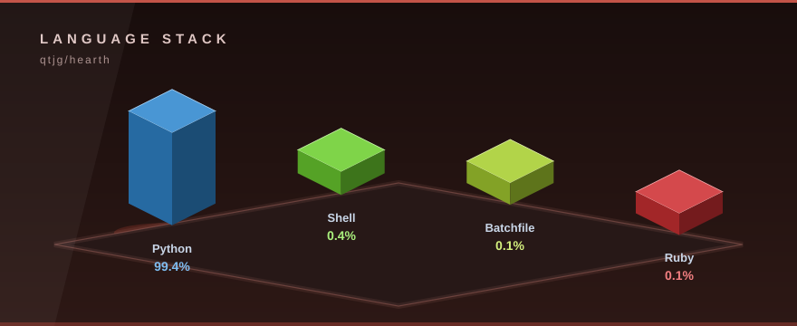
</p>

Isometric 3D language stack computed from live GitHub language stats.
Regenerate the graphics any time with the built-in generator — stdlib only, zero dependencies:

```bash
python tools/generate_3d_assets.py
```
