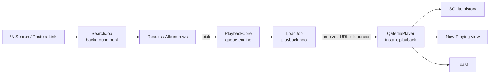
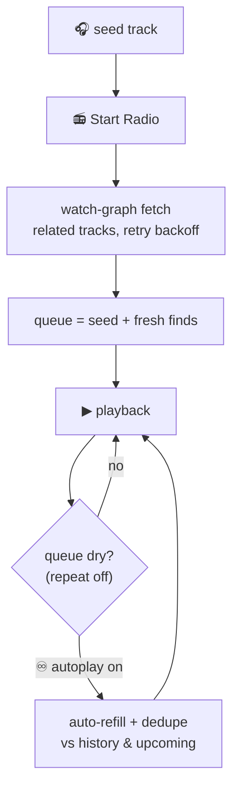

<div align="center">


[](https://github.com/qtjg/hearth)


**Hearth** is a full three-pane desktop music player for YouTube Music.
Sidebar navigation · Home shelves · Playlists · Now Playing · Bottom transport bar.

</div>

---

## 🔥 The Stack in 3D

Four layers, one campfire — drawn the way it sits in memory, widest at the
bottom where your library lives:

```text
                      ♪
                ╱▔▔▔▔▔▔▔▔▔▔▔▔╲
               ╱   UI LAYER   ╲
              ╱▁▁▁▁▁▁▁▁▁▁▁▁▁▁▁▁╲
             ╱▔▔▔▔▔▔▔▔▔▔▔▔▔▔▔▔▔▔╲
            ╱      APP CORE      ╲
           ╱▁▁▁▁▁▁▁▁▁▁▁▁▁▁▁▁▁▁▁▁▁╲
          ╱▔▔▔▔▔▔▔▔▔▔▔▔▔▔▔▔▔▔▔▔▔▔▔╲
         ╱       NETWORK I/O        ╲
        ╱▁▁▁▁▁▁▁▁▁▁▁▁▁▁▁▁▁▁▁▁▁▁▁▁▁▁▁╲
       ╱▔▔▔▔▔▔▔▔▔▔▔▔▔▔▔▔▔▔▔▔▔▔▔▔▔▔▔▔▔╲
      ╱         DATA · SQLITE          ╲
     ╱▁▁▁▁▁▁▁▁▁▁▁▁▁▁▁▁▁▁▁▁▁▁▁▁▁▁▁▁▁▁▁▁▁╲
```

| Layer | Modules | Role |
|:---|:---|:---|
| 🔲 **UI** | `window.py` · `panel.py` · `theme.py` · `cover.py` | sidebar, shelves, transport, Now Playing — all Palette-themed |
| 🧠 **Core** | `app.py` · `player.py` · `jobs.py` · `toast.py` | lifecycle, queue engine, autoplay, hotkeys |
| 🌐 **I/O** | `catalog.py` · `stream.py` · `tray.py` · `share.py` | YT Music guest API, yt-dlp resolver, tray, portable JSON |
| 💾 **Data** | `storage.py` · `models.py` · `config.py` · `utils.py` | the SQLite file you own — favorites, playlists, history |

---

## 🧠 How It Works (The Threading Architecture)

Stream resolution and catalogue search run completely asynchronously on
**isolated thread pools**, so audio decoding never queues behind heavy work:

1. **Playback Pool** — dedicated to `LoadJob`: the instant you pick a track,
   its audio stream is resolved off the GUI thread and handed to
   `QMediaPlayer`.
2. **Background Pool** — `SearchJob` (YT Music guest API with exponential
   retry backoff). Typing never stalls the window.



## 📻 The Radio Loop (Endless Autoplay)

Start Radio from any track — or just let the queue run dry with autoplay on.
The radio engine quietly refills from the YT Music watch graph, dedupes
against everything you've heard, and the music never stops:



## 🐍 The Firekeeper

The snake is fed by every real commit on `main` — it patrols the contribution
grid so the fire stays warm:

<picture>
  <source media="(prefers-color-scheme: dark)" srcset="https://raw.githubusercontent.com/qtjg/hearth/output/github-contribution-grid-snake-dark.svg" />
  <source media="(prefers-color-scheme: light)" srcset="https://raw.githubusercontent.com/qtjg/hearth/output/github-contribution-grid-snake.svg" />
  
</picture>

## 📊 Pulse

<div align="center">
  
  &nbsp;&nbsp;
  
</div>

---

## 🖼️ The Big Window (v0.3)

Hearth grew from a floating ribbon into a complete desktop music app, laid out
the way every major streaming client works — three panes, one window:

- **Left sidebar** — Home, Search, and Your Library navigation, plus all of
  your playlists with one-click creation.
- **Home** — horizontally scrolling shelves: Quick Picks seeded from guest-API
  searches, your Pinned favorites, and Recently played, all as big cover cards.
- **Search** — a prominent query box (debounced, link-aware) over clean result
  rows with mini covers, artist, and duration.
- **Your Library** — pinned favorites, recent history, and playlist cards.
- **Playlists** — create, rename, delete; add any track via its context menu
  (▶ Play next · ➕ Add to queue · ♡ Pin · 📌 Add to playlist); Play-all and
  Shuffle buttons on every playlist page.
- **Bottom player bar** — cover tile, ♡ pin, shuffle / repeat, prev / play /
  next, draggable seek with time labels, queue drawer, and a volume slider.
- **Queue drawer** — dockable "Up next" panel; right-click any row to remove it.

## 📻 Radio, Lyrics & Words (v0.4 / v0.5)

The clone wave: the features people actually live in on the big streaming
services, built on the same guest-API engine — no account, no keys:

- **Now Playing view** — a full page with a big cover, the current track's
  identity, a ♡ pin, and a live lyrics sheet (auto-loaded per track, cached,
  with a graceful "no lyrics" state).
- **📻 Start Radio** — right-click any track, hit the player-bar button, or
  press it on the Now Playing page: hearth fetches related tracks from the
  YT Music watch graph and queues them around your seed.
- **♾️ Endless autoplay** — when the queue runs dry (repeat off), the radio
  engine quietly refills it and the music keeps going. That's the whole point.
- **🔍 Search scopes** — ♪ Songs · ▶ Videos · 💿 Albums chips. Album results
  open a real album page with ▶ Play all and 🔀 Shuffle.
- **🎛️ Queue power tools** — drag & drop reordering (the playing row stays
  pinned), ▶ Play now, ↑↓ move, ✕ remove, and a Clear button. Double-click
  any upcoming row to jump straight to it.
- **🔥 Top tracks** — a Home shelf ranked by your real play counts.
- **⌨️ In-window keys** — `Space` play/pause · `←`/`→` seek ±10s · `↑`/`↓`
  volume · `/` search · `M` mute · `S` shuffle · `R` repeat · `N` now playing
  · `Q` queue — all guarded, so typing in the search box never triggers them.
- **💾 Library backup** — export or import every playlist as portable JSON
  (`.hearthplaylist.json`), plus full-library favorites+playlists export via
  the store API. Files are boring JSON on purpose: no lock-in, no cloud.
- **🔗 Copy YouTube link** — every track's context menu carries its URL.
- **🎚️ Speed cycler & ⏾ sleep menu** live on the player bar (`1x` and `⏾`).

Love the old vibe? The original floating ribbon is still there: run
`./launch.sh --ribbon` (or `python -m hearth --ribbon`) for the compact
always-on-top companion. Legacy and new share the same engine.

## ✨ What It Does

| Feature | The Vibe |
|:---|:---|
| 🖼️ **Three-pane main window** | Sidebar + home shelves + library views + bottom transport — the full desktop-player experience |
| 🎵 **Playlists that stick** | Create, rename, delete, reorder-safe add/remove — stored in the SQLite database you own |
| 📋 **Queue drawer** | See and prune what's coming; Play-next jumps the line, Add-to-queue appends |
| 🔍 **Search or paste** | Type a song name or drop a YouTube / YT Music link — debounced, retried, instant |
| 🪟 **Ribbon companion** | The classic floating always-on-top mini player still ships (`--ribbon`) for IDE-side listening |
| 🔀 **Shuffle & repeat** | Non-destructive upcoming-queue shuffle plus cycleable repeat (off / all / one), persisted across reboots |
| ⚡ **Speed control** | Cycle 0.75x → 1.0x → 1.25x → 1.5x via native `QMediaPlayer.setPlaybackRate()` |
| ⏾ **Sleep timer** | 15–60 minute presets with a gentle exponential volume fade-out before pausing |
| 🔊 **Loudness normalization** | Stream loudness is nudged toward a target so quiet/blast tracks stop yo-yoing the volume knob |
| 🎨 **Seven live themes** | Grove (the new default), Hearthlight, Emberfall, Frost, Moss, Orchid, and Slate re-skin everything in real time |
| ♥ **Favorites & history** | Pin tracks and revisit your listening history — local SQLite, no account, no telemetry |
| 🖥️ **Tray presence** | Play, pause, skip, or summon the window from the system tray; a second launch just wakes the first |
| ⌨️ **Hotkeys** | App-scope chords for every common action, with system-shortcut conflict detection |
| 📻 **Radio & autoplay** | Endless playback: Start Radio from any track, auto-refill when the queue dries |
| 📝 **Lyrics** | Now Playing page with auto-loaded lyrics, cache, and no-lyrics fallback |
| 💿 **Album pages** | Search Albums scope → full track list with Play all / Shuffle |
| 🔥 **Top tracks** | Home shelf ranked by your real play counts |
| 💾 **Remembers everything** | Window size/position, volume, theme, repeat mode, speed, autoplay, favorites, playlists, and history persist |

---

## 🐧 Arch Linux (First-Class)

Hearth is built on Arch. Two ways to run it:

### Option A — venv (recommended, most reliable)

```bash
sudo pacman -S --needed python python-pip ffmpeg git
git clone https://github.com/qtjg/hearth.git
cd hearth
./install.sh && ./launch.sh
```

The PyPI `PyQt6` wheel ships the FFmpeg multimedia backend for Linux, so audio
plays out of the box — no GStreamer plumbing required. `ffmpeg` covers the
occasional yt-dlp remux.

<details>
<summary>Tray icon notes per desktop</summary>

Works out of the box on KDE Plasma, Hyprland/sway (with a tray-capable bar like
Waybar), and any panel implementing `StatusNotifierItem`. On GNOME you'll need
an AppIndicator extension for the tray to appear — the floating ribbon itself
is unaffected.

</details>

### Option B — native pacman package

A [PKGBUILD](packaging/arch/PKGBUILD) is provided:

```bash
cd packaging/arch && makepkg -si
```

It builds against Arch's system Python and Qt6 stack (`python-pyqt6`,
`qt6-multimedia`, `gst-plugins-good`, `gst-libav`) with no venv isolation.

---

## 🪟 Windows & 🍎 macOS

```bat
install.bat
launch.bat        (or launch_debug.bat to watch the logs)
```

```bash
./install.sh && ./launch.sh
```

Both use an isolated `.venv` — your system Python stays untouched.

---

## ⌨️ Default Hotkeys

| Keys | Action |
|:---|:---|
| `Ctrl` + `Alt` + `Space` | Play / pause |
| `Ctrl` + `Alt` + `→` | Next track |
| `Ctrl` + `Alt` + `←` | Previous track |
| `Ctrl` + `Alt` + `E` | Toggle the window / ribbon |
| `Ctrl` + `Alt` + `F` | Focus search |

**In-window keys** (v0.5) work wherever you are — `Space` play/pause,
`←`/`→` seek ±10s, `↑`/`↓` volume, `/` focus search, `M` mute, `S` shuffle,
`R` repeat, `N` Now Playing, `Q` queue drawer. They yield automatically while
you're typing in the search box.

Bindings are merged from user overrides on top of the defaults and validated by
a conflict detector that flags duplicates and system-shortcut collisions
(`Ctrl+C`, `Alt+F4`, `Super+L`, …) before they can hurt you.

---

## 🗂️ Project Structure

```text
hearth/
├── hearth/
│   ├── app.py          → lifecycle, persistence, hotkeys, logging, radio wiring
│   ├── catalog.py      → YT Music guest search, scopes, radio, lyrics, retry backoff
│   ├── config.py       → palettes, tunables, hotkey defaults (single source of truth)
│   ├── cover.py        → cover tiles: painted flame fallback + async album art
│   ├── hotkeys.py      → conflict detection & override merging
│   ├── jobs.py         → QRunnable search/load workers on isolated pools
│   ├── models.py       → Track dataclass & serialization
│   ├── panel.py        → the floating ribbon (legacy companion UI)
│   ├── player.py       → queue engine (pure) + lazy Qt Multimedia backend
│   ├── share.py        → portable .hearthplaylist.json import / export codecs
│   ├── storage.py      → SQLite favorites, history, playlists & play counts
│   ├── stream.py       → yt-dlp resolver, format picker, loudness gain
│   ├── theme.py        → stylesheets compiled from Palette tokens
│   ├── toast.py        → non-focus-stealing now-playing toast
│   ├── tray.py         → tray presence, painted icon, single-instance guard
│   ├── window.py       → three-pane main window + Now Playing view
│   └── utils.py        → small zero-dependency helpers
├── tests/              → 155 headless tests (offscreen Qt platform)
├── packaging/arch/     → PKGBUILD for a native Arch package
├── install.sh / .bat   → one-command venv setup per OS
├── launch.sh / .bat    → silent desktop launchers
└── pyproject.toml      → `pip install .` gives you the `hearth` command
```

---

## 🧪 Testing

155 tests cover models, palettes, playlists, storage, retry backoff, format
picking, queue semantics, hotkey conflicts, the main window (views, player
bar, queue dock, pin flow), radio / lyrics / autoplay flows, playlist share
codecs, and the real app booting headless:

```bash
QT_QPA_PLATFORM=offscreen python -m pytest tests/ -v
```

CI runs the same suite on a **3 OS × 2 Python matrix** (ubuntu / windows /
macos × 3.11 / 3.13) on every push — the "every desktop" promise is enforced,
not just claimed.

---

## 🗺️ Roadmap

- 🎨 Artist pages & mood shelves
- 🎤 Synced (time-stamped) lyrics
- 🖼️ Drag-and-drop playlist track reordering
- 📦 AUR package publication

---

## 📜 License

**Hearth** is distributed under the [MIT License](LICENSE).

<div align="center">


</div>
